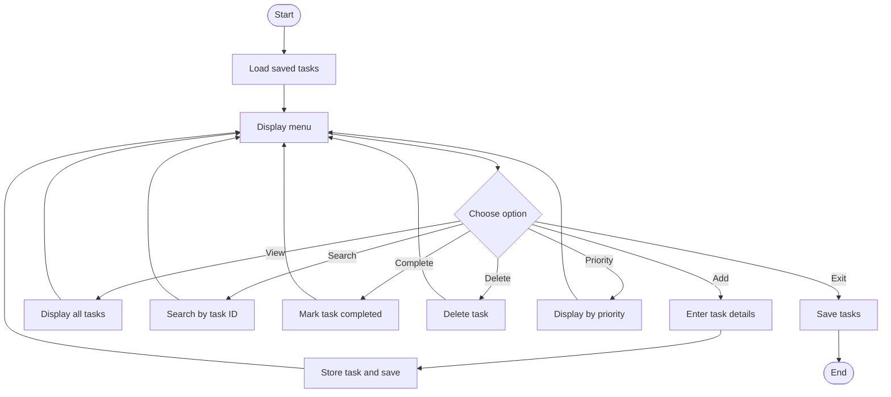

# Flowchart

```mermaid
flowchart TD
    A([Start]) --> B[Load saved tasks]
    B --> C[Display menu]
    C --> D{Choose option}
    D -->|Add| E[Enter task details]
    E --> F[Store task and save]
    D -->|View| G[Display all tasks]
    D -->|Search| H[Search by task ID]
    D -->|Complete| I[Mark task completed]
    D -->|Delete| J[Delete task]
    D -->|Priority| K[Display by priority]
    F --> C
    G --> C
    H --> C
    I --> C
    J --> C
    K --> C
    D -->|Exit| L[Save tasks]
    L --> M([End])
```
